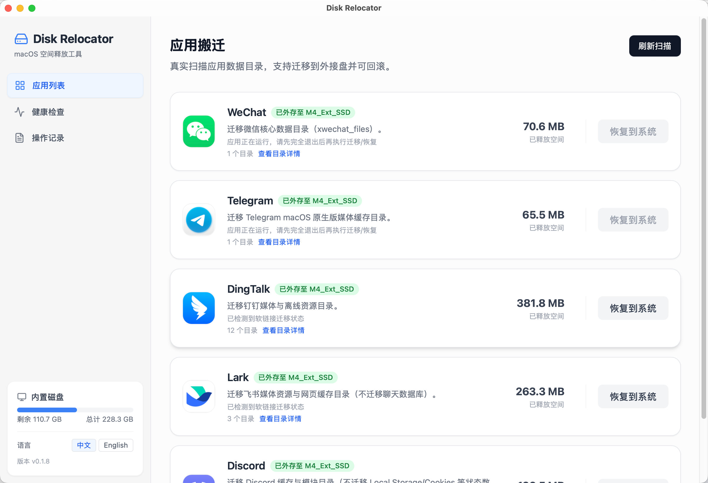
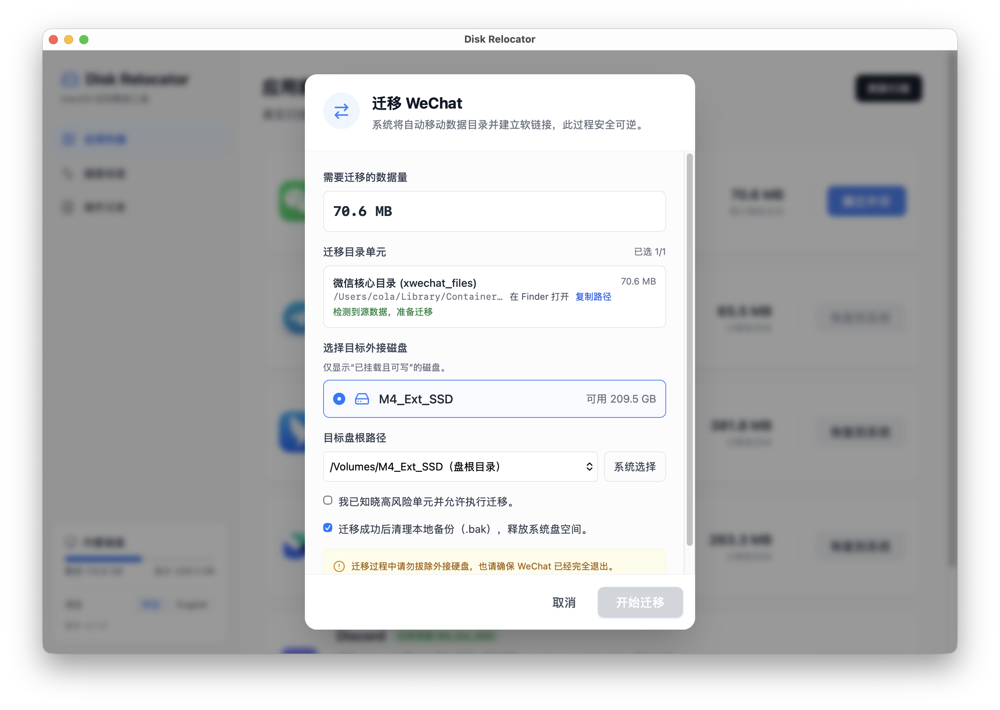
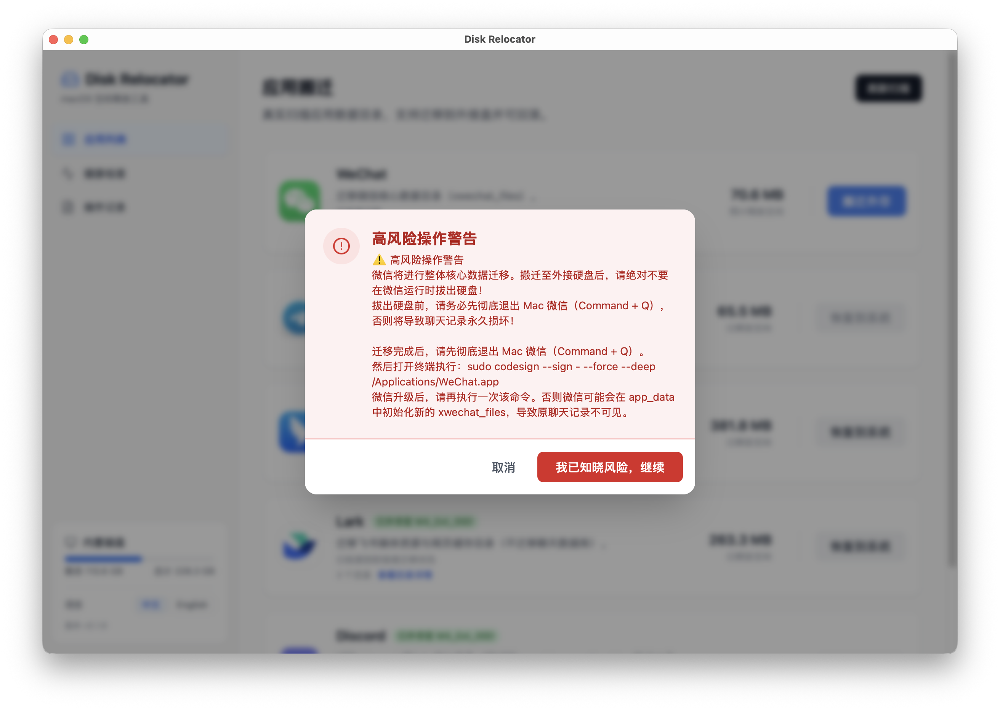
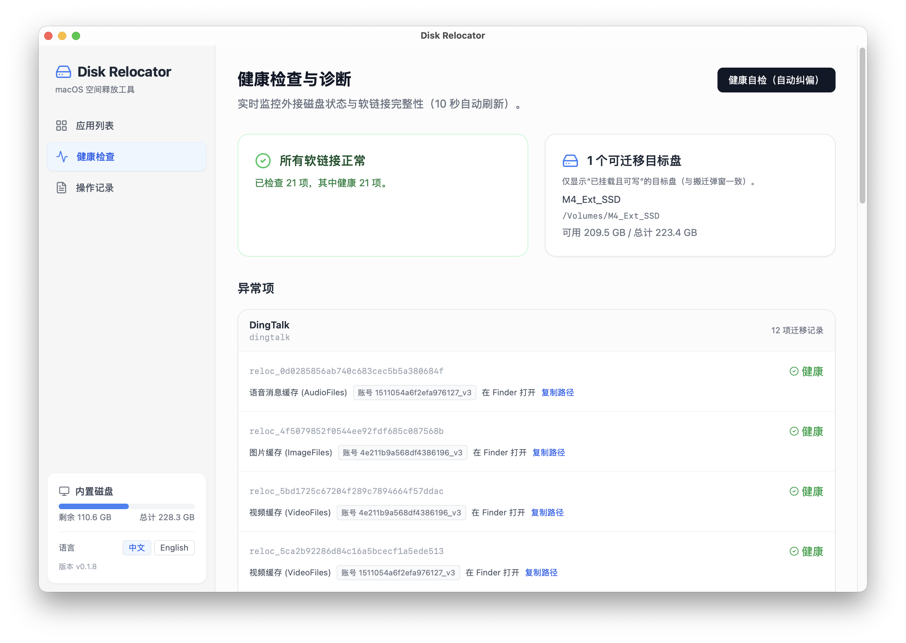
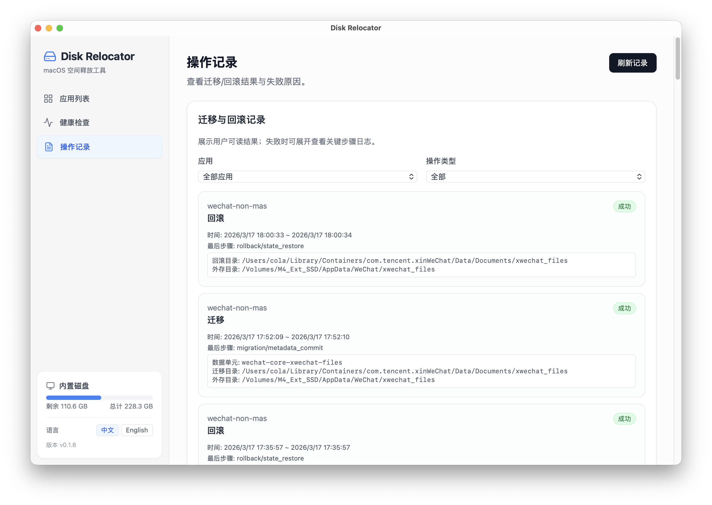

# Disk Relocator

> **重要免责声明（请先完整阅读）**
> **本软件按“原样”（AS IS）提供，不提供任何明示或暗示担保，包括但不限于适销性、特定用途适用性和不侵权担保。**
> **本工具涉及应用数据迁移、软链接切换及（部分场景下）应用重签名，可能导致应用崩溃、功能异常、账号风险（含封禁）、权限重置、数据损坏或数据丢失。**
> **你应在完整备份后自行评估并承担使用风险；因使用或无法使用本软件造成的任何直接或间接损失，开发者不承担责任。**
> **本项目为独立开源项目，开发者与腾讯、字节跳动、阿里巴巴及其关联公司无任何隶属、授权、合作或背书关系。**
> **本仓库官方发布版本永久免费，且不包含商业化运营行为（无付费功能、无广告、无数据售卖）。**

把聊天软件等大目录搬到外接盘，释放 macOS 系统盘空间；需要时可恢复回系统盘。

## 法律与使用边界

- 本工具仅提供本地文件迁移能力，不提供任何对第三方软件或账号可用性的承诺。
- 使用者需自行确认并遵守所在地区法律法规，以及目标应用的软件许可、服务条款和账号规则。
- 涉及 `sudo`、`codesign`、权限授权等系统级操作时，均应由使用者在终端中手动执行并承担后果。

## 背景定位（先看这个）

这个工具主要面向：

- 丐版 Mac mini / 小容量 Mac（系统盘长期紧张）
- 外接 SSD 长期挂载在同一台机器上使用
- 希望把微信、Telegram、钉钉、飞书、Discord 等目录迁到外盘

不建议用于：

- 经常拔插硬盘、经常移动办公的场景
- 需要“随时脱离外接盘也完全不受影响”的场景

一句话：**更适合固定工位、长期外挂盘，不适合高频移动场景。**

## 使用前准备

1. 准备一个稳定的外接 SSD（建议 APFS）。
2. 迁移前先关闭目标应用（尤其是微信）。
3. 迁移过程中不要拔盘，使用中也尽量保持外盘已挂载。

## 5 分钟上手

1. 打开应用，点击`刷新扫描`。
2. 在`应用列表`里找到目标应用，点击`搬迁外存`。
3. 在弹窗里确认迁移目录、选择目标外接盘，点击`开始迁移`。
4. 迁移后到`健康检查`确认状态正常。
5. 需要恢复时，在应用卡片点击`恢复到系统`。

## 当前支持的应用

- WeChat（Non-MAS）
- Telegram（macOS 原生版）
- 钉钉（DingTalk）
- 飞书（Feishu / Lark）
- Discord

说明：实际可用应用列表以线上发布的 `app-profiles.json` 为准。
如需新增应用支持，欢迎在 [Issues](https://github.com/boe1900/disk-relocator/issues) 提交应用名称、版本号、数据目录路径与使用场景。

## 微信特别说明（用户自愿手动操作）

如果微信迁移后出现历史记录不可见等异常，你可在自行评估风险后，手动执行重签名命令：

1. 先彻底退出微信（`Command + Q`）。
2. 在终端中手动执行（需要 `sudo`）：

```bash
sudo codesign --sign - --force --deep /Applications/WeChat.app
```

说明：

- `codesign` 命令不会由 Disk Relocator 在后台自动执行，也不会绕过系统权限静默执行。
- 该步骤完全由用户手动触发、手动授权、手动承担风险。
- 微信每次升级后，如再次出现相关问题，可再次手动执行上述命令。

### 微信截图权限重置（重点）

执行下面这条命令后：

```bash
sudo codesign --sign - --force --deep /Applications/WeChat.app
```

macOS 可能触发隐私保护机制，重置微信的截图权限（屏幕录制权限），因此需要重新设置一次授权。

修复只需约 1 分钟：

1. 打开 `系统设置 -> 隐私与安全性 -> 屏幕录制（Screen Recording）`。
2. 在右侧列表中找到`微信（WeChat）`。
3. **关键一步：不要只是关掉再打开。请选中微信，点击列表下方的 `-`（减号）把它彻底删掉。**
4. 打开微信，随便触发一次截图（按截图快捷键，或点击聊天框的剪刀图标）。
5. 系统会重新弹窗提示“微信想录制您的屏幕”，点击去设置里重新授权，并把微信开关打开即可。

## 隐私与联网说明

- 核心迁移、回滚、健康检查逻辑均在本地执行，不会上传聊天记录、数据库内容或用户文件。
- 当前版本默认会请求一次 GitHub 发布地址中的 `app-profiles.json`，用于获取最新应用适配规则。
- 该请求仅用于下载规则文件与缓存校验（`ETag`），不包含本地迁移文件内容。
- 若网络不可用，将自动回退到本地缓存/内置配置，不影响本地数据安全边界。
- 当前版本不包含 Telemetry/Analytics 统计上报代码。

## 许可证与非盈利承诺

- 本项目采用 [MIT License](LICENSE)。
- 官方仓库发布版本永久免费，项目维护方不提供付费版、广告版或数据商业化服务。
- 任何第三方分叉或再分发行为，均不代表本项目维护者立场。

## 截图预览

应用列表（扫描与迁移入口）：



迁移弹窗（选择目标盘并确认迁移单元）：



微信高风险提醒（迁移前）：



健康检查（查看挂载与软链接状态）：



操作记录（查看迁移/回滚结果）：



## 下载与安装

1. 在 [Releases](https://github.com/boe1900/disk-relocator/releases) 下载最新 `.dmg`。
2. 拖动 `Disk Relocator.app` 到 `/Applications`。
3. 首次打开如被拦截：右键应用 -> `打开`。

如果仍被阻止，可执行：

```bash
xattr -dr com.apple.quarantine /Applications/"Disk Relocator.app"
open -a "Disk Relocator"
```

## 常见问题

1. 迁移后应用打不开或数据异常怎么办？
   - 先确认外接盘已挂载；
   - 到`健康检查`查看异常；
   - 必要时执行`恢复到系统`。
2. 外接盘临时断开会怎样？
   - 软链接目标不可用时，应用可能异常；
   - 重新挂载后可恢复，或直接回滚到系统盘。
3. 这个工具是否适合笔记本经常移动场景？
   - 不建议。它更适合固定工位 + 长期外接盘。

## 文档

- [FAQ](docs/faq.md)
- [健康检查、修复与回滚指南](docs/health-fix-and-rollback-guide.md)
- [微信验证说明](docs/validation-wechat.md)
