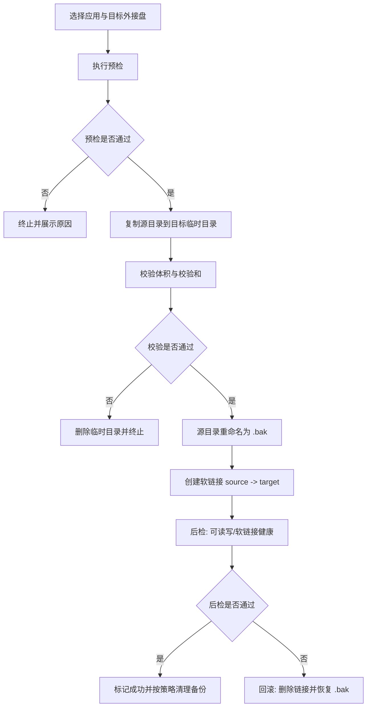

# 迁移与回滚流程

## 1. 核心原则

不能只靠一次性 `mv + ln -s`。

应采用“类事务”流程：
1. 预检
2. 复制
3. 校验
4. 原子切换
5. 后检
6. 清理

任一步失败即自动回滚。

## 2. 架构（Tauri + Rust）

- 前端（Vue）：
  - 应用列表
  - 占用体积显示
  - 一键迁移
  - 健康状态面板
- 后端（Rust）：
  - 扫描器
  - 迁移引擎
  - 健康监控器
  - 元数据存储（SQLite 或 JSON）

## 3. 迁移流程图



## 4. 迁移前预检清单

1. 应用进程未运行
2. 源路径存在且可读
3. 目标外接盘已挂载且可写
4. 目标可用空间大于源数据体积并留有安全余量
5. 源路径当前不是软链接
6. profile `availability` 与 unit 策略允许执行迁移

## 5. 回滚策略

触发条件：
- 复制校验失败
- 软链接创建失败
- 后检失败
- 用户在最终提交前取消

回滚动作：
1. 如已创建软链接则先删除
2. 从备份名恢复原目录
3. 清理不完整目标临时目录
4. 将元数据状态恢复到迁移前

## 6. 健康监控

运行时检查（周期轮询 + 挂载事件触发）：
1. 软链接是否存在
2. 软链接目标是否存在
3. 目标挂载点是否在线
4. 目标路径可读写探针是否通过

状态模型：
- `healthy`
- `degraded`（目标缺失或只读）
- `broken`（链接失效或源路径异常）

## 7. 迁移记录示例

```json
{
  "relocation_id": "reloc_20260305_001",
  "app_id": "telegram-desktop",
  "source_path": "/Users/cola/Library/Application Support/Telegram Desktop",
  "target_path": "/Volumes/ExternalSSD/AppData/Telegram Desktop",
  "backup_path": "/Users/cola/Library/Application Support/Telegram Desktop.bak",
  "state": "healthy",
  "created_at": "2026-03-05T10:00:00Z",
  "updated_at": "2026-03-05T10:05:00Z"
}
```
