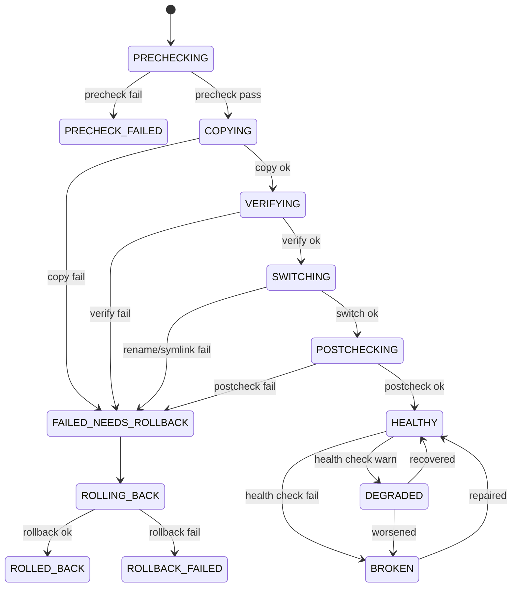
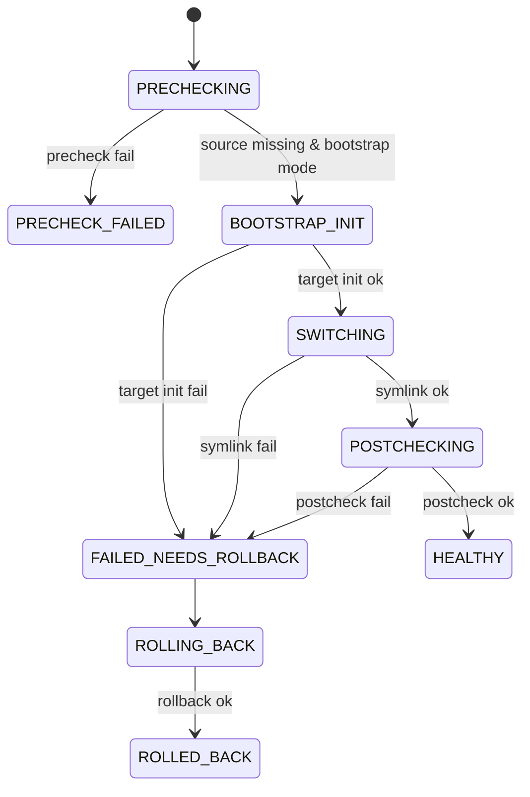

# Migration State Machine v1

本文件冻结迁移状态流转，作为后续实现和测试的单一依据。

## 1. 主流程状态图（已有数据迁移）

## 2. 首次引导模式状态图（首次直接落盘外接盘）

## 3. 状态定义

| 状态 | 说明 |
|---|---|
| `PRECHECKING` | 执行运行态/权限/磁盘/空间/分级检查 |
| `PRECHECK_FAILED` | 预检不通过，未进入文件变更 |
| `BOOTSTRAP_INIT` | 首次引导模式初始化目标目录 |
| `COPYING` | 复制源数据到目标临时目录 |
| `VERIFYING` | 大小或校验和验证 |
| `SWITCHING` | 原子切换（源改名 + 创建软链接） |
| `POSTCHECKING` | 链接完整性与读写探针 |
| `HEALTHY` | 可用且健康 |
| `DEGRADED` | 可用但有风险（如只读） |
| `BROKEN` | 不可用（断链/目标缺失） |
| `FAILED_NEEDS_ROLLBACK` | 当前事务失败且需自动回滚 |
| `ROLLING_BACK` | 自动或手动回滚中 |
| `ROLLED_BACK` | 已回到迁移前一致状态 |
| `ROLLBACK_FAILED` | 回滚未完成，需人工介入 |

## 4. 中断恢复规则

1. 进程重启后扫描 `PRECHECKING/COPYING/VERIFYING/SWITCHING/POSTCHECKING/ROLLING_BACK` 记录。
2. 若发现 `SWITCHING` 已执行部分动作，优先进入 `ROLLING_BACK`。
3. `HEALTHY/DEGRADED/BROKEN/ROLLED_BACK/PRECHECK_FAILED` 均为稳定态，不自动改写。
4. 任何恢复动作必须写入同一 `trace_id` 的续写日志。

## 5. 幂等约束

1. `ROLLING_BACK` 可重复执行，多次执行结果一致。
2. `PRECHECKING` 不修改文件系统，可重复触发。
3. `MIGRATE_CLEANUP_FAILED` 不影响最终稳定态，可异步重试清理。

